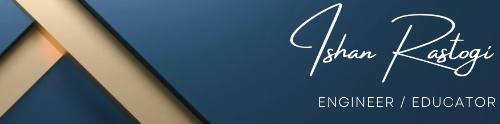
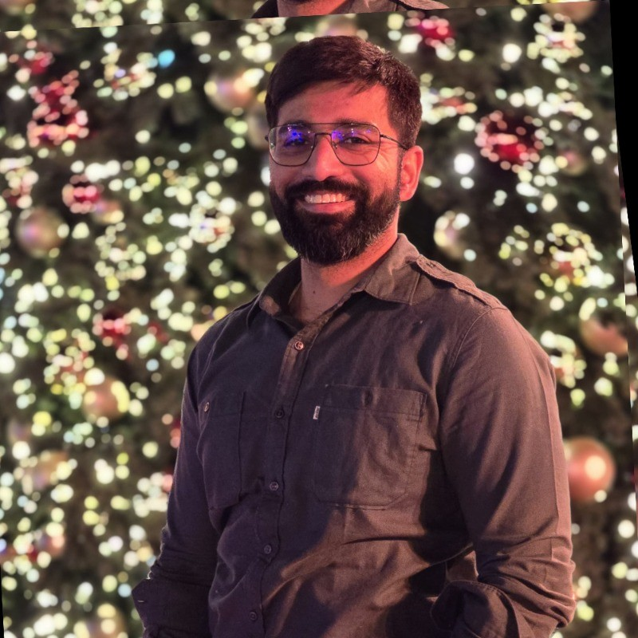

<!-- Banner -->

  

<!-- Avatar + Headline -->

  

<h1 align="center">Ishan Rastogi</h1>

  <b>Head of Data, Development & AI</b> 
  <i>Driving scalable systems, data excellence, and intelligent automation.</i>

  
  
  
  

---

### 👋 About me
I architect modern platforms and build high-performing remote-first teams. I blend **technology strategy** with **hands-on delivery** across backend, data, cloud, and AI. I’m excited by **Agentic AI**, **Model Context Protocol (MCP)**, and pragmatic **RAG** to automate analytics and decision-making for real business value.

- 🧭 **Focus:** Platform & data architecture, AI enablement, delivery excellence, DevEx, SRE/observability  
- 🧩 **Tooling:** Kotlin · Node.js · React · GCP/AWS · Kubernetes · Terraform · Airflow · BigQuery · CI/CD  
- 🧠 **AI:** Agentic AI · MCP · RAG · Vertex AI · OpenAI/Claude/Gemini · HF Transformers · Vector DBs (FAISS/Pinecone/Chroma)

---

### 🧾 Executive snapshot
- ⚙️ **40% faster releases** & **30% fewer incidents** via CI/CD + observability improvements  
- 🏬 Designed the **single source of truth** platform adopted across **900+ retail locations** (Fielmann)  
- 🧑‍🤝‍🧑 Built & led **20+** engineers/data across multiple product lines, remote-first  
- 🤖 Shipped **RAG/agentic AI** workflows; **50% faster** insights turnaround for stakeholders

---

### 🚢 Experience (selected)
**Head of Development, Data & AI – Emnos Analytics GmbH (2023–present), Munich**  
Led multi-track engineering (backend, data, AI). Introduced RAG & **agentic AI** workflows; standardized CI/CD; improved velocity and reliability.  
_Stack:_ Kotlin, Node, React, GCP (BQ/Spark), Airflow, Terraform, PostgreSQL, Firebase, Gemini/HF.

**Head of Engineering – MyFlo Ltd (2014–2017), London**  
Scaled the org from **2 → 21** engineers across London/Cardiff. Introduced agile, CI/CD, and delivery standards across multiple client products.

**Senior Software Engineer – Fielmann AG (2021–2023), Hamburg**  
Designed the **central single source of truth** platform consolidating multi-channel operational data; unified APIs/schemas enabled faster delivery across teams.  
_Stack:_ Kotlin, Node, AWS (Dynamo/Mongo), PostgreSQL, Helm/K8s, Pulumi.

**Senior Software Engineer – InnoGames GmbH (2019–2021), Hamburg**  
Modernized a top web/mobile game (5M+ players). Downtime ↓**25%**, deployment cadence ↑**20%**, release issues ↓**40%**.  
_Stack:_ PHP, C#, Java, PostgreSQL, CircleCI, Terraform.

**Senior Software Engineer – Dept (2018–2019), Hamburg**  
Delivered enterprise B2B/B2C platforms; led agile delivery; supported recruiting and mentoring.

**Education Mentor – W3Schools & Masterschool (2022–present)**  
Mentored **500+** learners in data engineering, security, and full-stack development (EN/DE). Built project-based tracks and interview prep programs.

> 👉 Ask me about: **agentic AI for ops/analytics**, **MCP-enabled tool calling**, **data product platforms**, **developer experience at scale**.

---

### 🧰 Tech stack
**Languages & Frameworks:** Kotlin · Java · Node.js · Python · React · TypeScript · Micronaut · Spring Boot · FastAPI · .NET  
**Cloud & Infra:** GCP · AWS · Kubernetes · Terraform · Pulumi · Helm · GitHub Actions · GitLab CI · CircleCI  
**Data & AI:** BigQuery · Airflow · PostgreSQL/MySQL/Mongo/Dynamo · Elasticsearch · Redis · **RAG** · **Agentic AI** · **MCP** · Vertex AI · OpenAI/Claude/Gemini · HF Transformers · FAISS/Pinecone/Chroma

---

### 🛠️ Services (Fractional CTO & hands-on engineering)
- **Interim/Fractional Leadership:** strategy → execution, org design, hiring, OKRs, delivery governance  
- **Platform & Data Architecture:** evented services, data products, lake/warehouse, contracts & governance  
- **AI Enablement:** **Agentic AI**, **MCP** integrations, RAG pipelines, evals, safety, observability  
- **Cloud & DevOps:** GCP/AWS, K8s, Terraform/Pulumi, CI/CD, SRE practices  
- **Delivery Coaching:** discovery → roadmaps, KPIs/SLIs, DevEx, paved roads

> 💬 **Let’s talk:** [Email](mailto:rastogiishan90@gmail.com) · [LinkedIn](https://www.linkedin.com/in/rastogiishan) ·
> <a href="/assets/Ishan Rastogi.pdf">Download CV</a>

---

🗺️ What I’m exploring now (click)

- **Model Context Protocol (MCP)** for secure, auditable tool integrations  
- **Agentic AI** patterns for analytics automation & operational copilots  
- **Data product platforms** (contracts, lineage, governance, costs)  
- **DevEx at scale:** golden paths, IDPs, Backstage, platform KPIs

  “Strategy that ships.”

